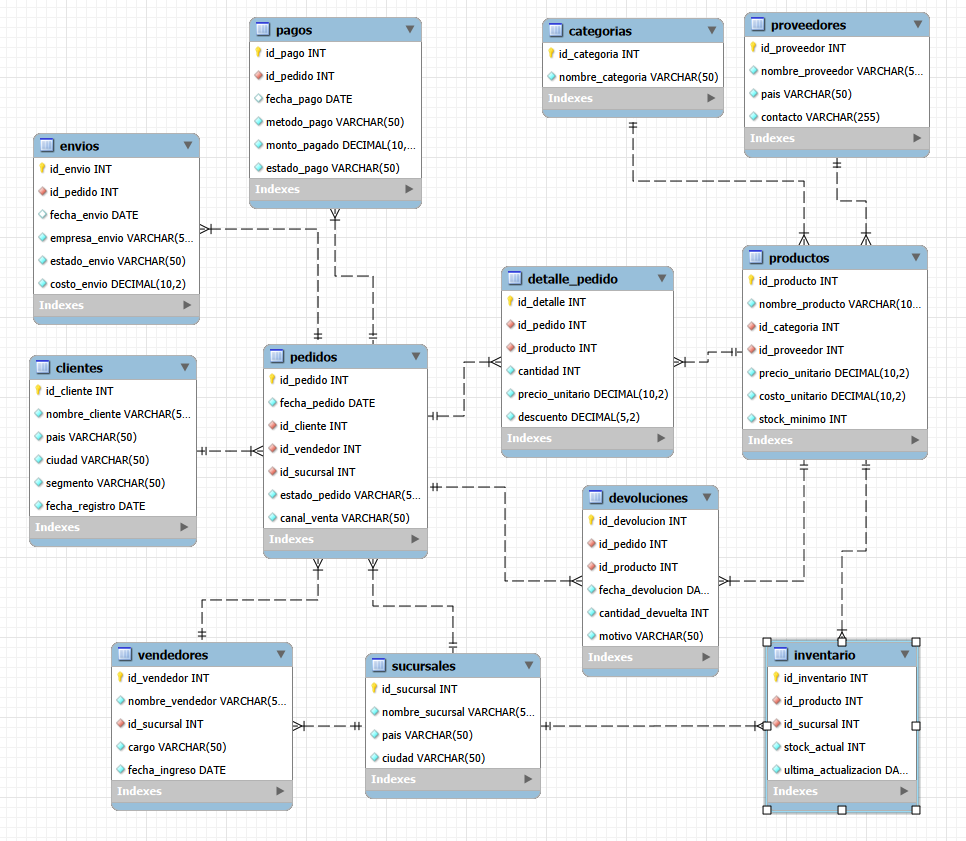
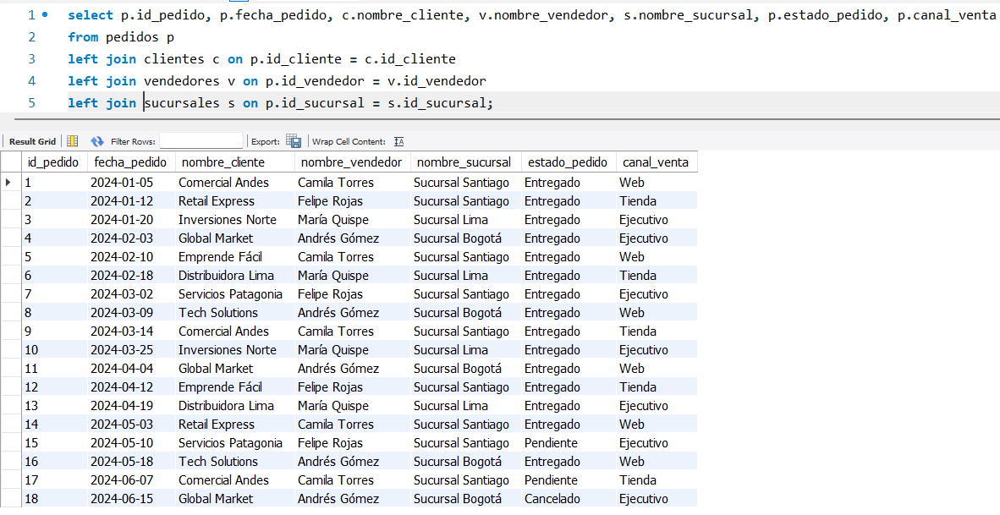
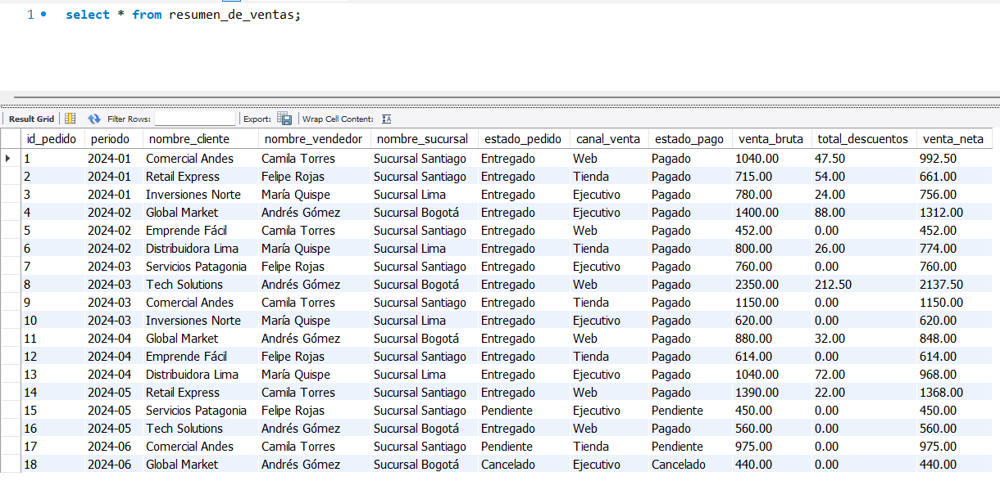
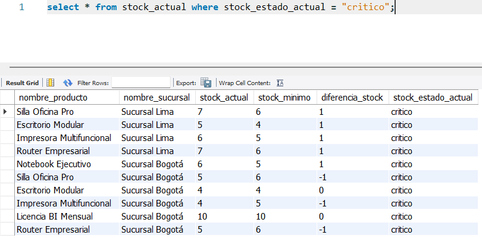
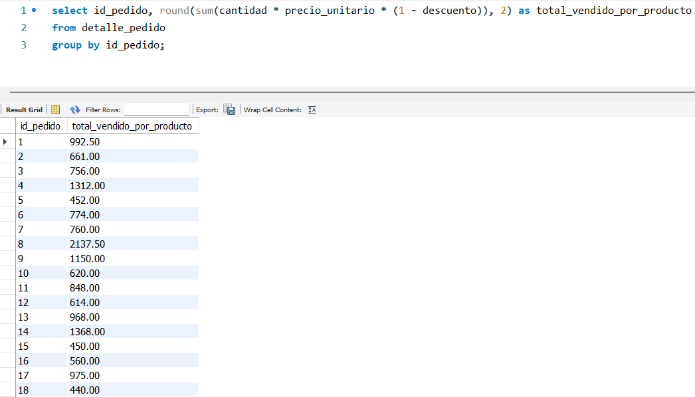
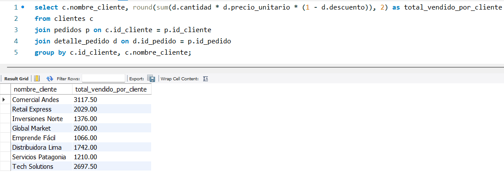
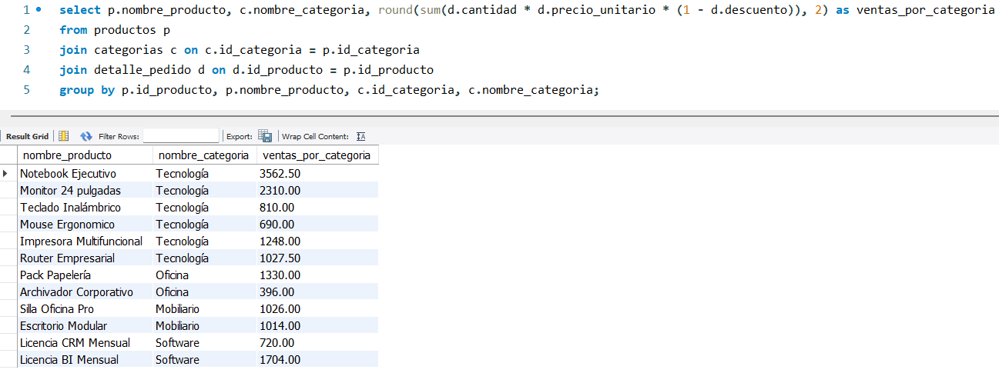

# 🗄️ ERP Comercial — Proyecto SQL

Simulación de un sistema ERP comercial construido en **MySQL**, que modela el ciclo completo de ventas, inventario, clientes y pagos de una empresa con presencia en 3 países de Latinoamérica.

Proyecto desarrollado como práctica de SQL, con enfoque en análisis de datos.

Los datos son ficticios y generados para fines educativos.

---

## 🛠️ Tecnologías


---

## 🎯 Objetivo

Desarrollar habilidades de análisis de datos mediante SQL, aplicadas a un sistema ERP comercial simulado. El proyecto busca consolidar el uso de JOINs, subconsultas, funciones de agregación, agrupaciones y filtros complejos para responder preguntas de negocio reales sobre ventas, clientes, productos, inventario y operaciones.

---

## ❓ Preguntas a Responder con este Proyecto

### 📊 Ventas y Rentabilidad
- ¿Cuál es el total de ingresos por sucursal y por mes?
- ¿Qué productos generan mayor margen de ganancia?
- ¿Qué canal de venta genera más ingresos?

### 👥 Clientes y Segmentación
- ¿Qué cliente tiene mayor volumen de compras acumulado?
- ¿Qué segmento de clientes es más rentable?

### 🧑‍💼 Rendimiento de Vendedores
- ¿Qué vendedor tiene el mayor número de ventas acumuladas?
- ¿Cuál es el ingreso total generado por cada vendedor?
- ¿Qué vendedores tienen pedidos con estado pendiente o cancelado?

### 📦 Inventario y Operaciones
- ¿Qué productos tienen stock por debajo del mínimo requerido?
- ¿Cuántas devoluciones ha registrado cada producto y cuál es el motivo más frecuente?

### 💳 Pagos y Logística
- ¿Qué pedidos tienen pago pendiente o fueron cancelados?
- ¿Cuál es el costo promedio de envío por empresa de logística?
- ¿Qué método de pago es el más utilizado?

---

## 🗂️ Estructura del Proyecto

```
erp-comercial-sql/
│
├── README.md
├── screenshots/
│   ├── diagrama_er.png                      -- Diagrama entidad-relación
│   └── pedidos_cliente_vendedor_sucursal    -- Capturas de resultados clave
│   └── resumen_ventas.png                   -- Capturas de resultados clave
│   └── stock_critico.png                    -- Capturas de resultados clave
│   └── total_vendido_por_pedido.png         -- Capturas de resultados clave
|   └── ventas_acumuladas_por_cliente.png    -- Capturas de resultados clave  
|   └── ventas_por_producto_categoria.png    -- Capturas de resultados clave
├── scripts/
│   ├── 01_crear_tablas.sql                  -- DDL: estructura completa de la base de datos
│   ├── 02_insertar_datos.sql                -- DML: datos de prueba
│   └── 03_consultas.sql                     -- Consultas generales de análisis
├── objetos/
│   ├── vistas.sql                           -- Vistas: resumen_de_ventas y stock_actual
│   ├── funciones.sql                        -- Función: calcular_totales_con_descuento
│   ├── procedimientos.sql                   -- Procedimiento: resumir_compras_por_cliente
│   ├── triggers.sql                         -- Trigger: actualizar_inventario
│   ├── indices.sql                          -- Índices de optimización
│   └── transacciones.sql                    -- Transacción: actualizar inventario y pagos
└── analisis/
    └── preguntas_negocio.sql                -- 10 preguntas de negocio respondidas
```

---

## 🚧 Modelo de Datos

📌 Diagrama ER



### Tablas de Hechos
Registran eventos o transacciones del negocio — contienen métricas y claves foráneas.

| Tabla | Descripción | Columnas principales |
|---|---|---|
| `pedidos` | Cabecera de cada venta registrada | `id_pedido`, `fecha_pedido`, `id_cliente`, `id_vendedor`, `id_sucursal`, `estado_pedido`, `canal_venta` |
| `detalle_pedido` | Líneas de producto por pedido | `id_detalle`, `id_pedido`, `id_producto`, `cantidad`, `precio_unitario`, `descuento` |
| `pagos` | Estado y monto de pago por pedido | `id_pago`, `id_pedido`, `fecha_pago`*, `metodo_pago`, `monto_pagado`, `estado_pago` |
| `envios` | Seguimiento logístico de cada pedido | `id_envio`, `id_pedido`, `fecha_envio`*, `empresa_envio`, `estado_envio`, `costo_envio` |
| `devoluciones` | Registro de devoluciones con motivo | `id_devolucion`, `id_pedido`, `id_producto`, `fecha_devolucion`, `cantidad_devuelta`, `motivo` |
| `inventario` | Stock actual por producto y sucursal | `id_inventario`, `id_producto`, `id_sucursal`, `stock_actual`, `ultima_actualizacion` |

> *`fecha_pago` y `fecha_envio` permiten valores `NULL` — representan pagos o envíos aún no procesados.
> Todas las demás columnas están definidas como `NOT NULL`.

### Tablas de Dimensión
Proveen contexto descriptivo a las tablas de hechos.

| Tabla | Descripción | Columnas principales |
|---|---|---|
| `clientes` | Registro de clientes por país y segmento | `id_cliente`, `nombre_cliente`, `pais`, `ciudad`, `segmento`, `fecha_registro` |
| `vendedores` | Vendedores asignados a cada sucursal | `id_vendedor`, `nombre_vendedor`, `id_sucursal`, `cargo`, `fecha_ingreso` |
| `sucursales` | 3 sucursales en Latinoamérica | `id_sucursal`, `nombre_sucursal`, `pais`, `ciudad` |
| `productos` | Catálogo con precio, costo y stock mínimo | `id_producto`, `nombre_producto`, `id_categoria`, `id_proveedor`, `precio_unitario`, `costo_unitario`, `stock_minimo` |
| `categorias` | Clasificación de productos | `id_categoria`, `nombre_categoria` |
| `proveedores` | Proveedores por país con contacto | `id_proveedor`, `nombre_proveedor`, `pais`, `contacto` |

---

## 📷 Capturas de resultados clave

### Pedidos con informacion del cliente, el vendedor y la sucursal



### Vista creada del resumen de ventas



### Productos con stock critico por sucursal



### Total de Ventas por pedido



### Ventas acumuladas por clientes



### Ventas acumuladas por producto y categoria




---

## ⚙️ Objetos de Base de Datos

### 👁️ Vistas

#### `resumen_de_ventas`
Consolida pedidos con cliente, vendedor, sucursal, canal, estado de pago y métricas financieras (venta bruta, descuentos y venta neta).

```sql
-- Ejemplo de uso
SELECT nombre_vendedor, SUM(venta_neta) AS total
FROM resumen_de_ventas
GROUP BY nombre_vendedor
ORDER BY total DESC;
```
> 📄 Código completo en `objetos/vistas.sql`

---

#### `stock_actual`
Muestra el stock por producto y sucursal con clasificación automática en tres niveles de alerta.

```sql
-- Ejemplo de uso
SELECT * FROM stock_actual
WHERE stock_estado_actual = 'critico';
```

| Estado | Criterio |
|---|---|
| `normal` | `stock_actual - stock_minimo >= 5` |
| `bajo` | `stock_actual - stock_minimo` entre 2 y 4 |
| `critico` | `stock_actual - stock_minimo < 2` |

> 📄 Código completo en `objetos/vistas.sql`

---

### ƒ Función

#### `calcular_totales_con_descuento(cantidad, precio_unitario, descuento)`
Calcula el total neto de una línea de venta aplicando el descuento proporcional.

```sql
-- Ejemplo de uso
SELECT calcular_totales_con_descuento(2, 950.00, 0.10);
-- Resultado: 1710.00

-- Aplicada sobre detalle_pedido
SELECT id_detalle,
       calcular_totales_con_descuento(cantidad, precio_unitario, descuento) AS total_neto
FROM detalle_pedido;
```
> 📄 Código completo en `objetos/funciones.sql`

---

### 📦 Procedimiento Almacenado

#### `resumir_compras_por_cliente(p_nombre)`
Retorna el historial de compras de un cliente por nombre. Incluye manejo de cliente inexistente.

```sql
-- Ejemplo de uso
CALL resumir_compras_por_cliente('Tech Solutions');
CALL resumir_compras_por_cliente('Cliente Inexistente');
-- Retorna: 'El cliente ingresado no existe'
```
> 📄 Código completo en `objetos/procedimientos.sql`

---

### ⚡ Trigger

#### `actualizar_inventario`
Se dispara automáticamente después de cada `INSERT` en `detalle_pedido`. Descuenta el stock real vendido en la sucursal correspondiente al pedido.

```sql
-- Se activa automáticamente al ejecutar:
INSERT INTO detalle_pedido (id_detalle, id_pedido, id_producto, cantidad, precio_unitario, descuento)
VALUES (37, 18, 1, 3, 950.00, 0.00);
-- El inventario del producto 1 en la sucursal del pedido 18 se reduce en 3 unidades
```
> 📄 Código completo en `objetos/triggers.sql`

---

### 🔁 Transacción

#### Actualizar inventario y pagos
Ejecuta de forma atómica el descuento de stock y el registro del pago. Si alguna operación falla, se revierte todo con `ROLLBACK`.

```sql
START TRANSACTION;
    UPDATE inventario SET stock_actual = stock_actual - cantidad ...;
    UPDATE pagos SET estado_pago = 'Pagado', monto_pagado = ... ;
COMMIT; -- o ROLLBACK si algo falla
```
> 📄 Código completo en `objetos/transacciones.sql`

---

### 🔍 Índices

Índices creados sobre columnas de búsqueda y JOIN frecuente para optimizar el rendimiento de las consultas de análisis.

| Índice | Tabla | Columna(s) |
|---|---|---|
| `idx_pedidos_estado` | `pedidos` | `estado_pedido` |
| `idx_pedidos_cliente` | `pedidos` | `id_cliente` |
| `idx_pedidos_vendedor` | `pedidos` | `id_vendedor` |
| `idx_pedidos_sucursal` | `pedidos` | `id_sucursal` |
| `idx_pedidos_fecha` | `pedidos` | `fecha_pedido` |
| `idx_detalle_pedido` | `detalle_pedido` | `id_pedido` |
| `idx_detalle_producto` | `detalle_pedido` | `id_producto` |
| `idx_inventario_producto_sucursal` | `inventario` | `id_producto`, `id_sucursal` |
| `idx_pagos_estado` | `pagos` | `estado_pago` |
| `idx_pagos_pedido` | `pagos` | `id_pedido` |

> 📄 Código completo en `objetos/indices.sql`

---

## 📊 Análisis de Negocio

Preguntas de negocio respondidas con SQL — considerando únicamente pedidos con `estado_pedido = 'Entregado'`:

| # | Pregunta | Resultado |
|---|---|---|
| 1 | ¿Qué cliente realizó el mayor total de compras? | Tech Solutions → $2,697.50 |
| 2 | ¿Qué vendedor generó más ventas? | Andrés Gómez → $4,857.50 |
| 3 | ¿Qué producto tuvo más unidades vendidas? | Pack Papelería → 38 unidades |
| 4 | ¿Qué pedido tuvo el mayor monto? | Pedido #8 → $2,137.50 |
| 5 | ¿Qué canal de venta generó más ingresos? | Web → $6,358.00 |
| 6 | ¿Qué sucursal realizó más ventas? | Sucursal Santiago → $7,422.50 |
| 7 | ¿Qué productos presentan stock crítico? | 10 registros en sucursales Lima y Bogotá |
| 8 | ¿Qué pedidos siguen pendientes o cancelados? | Pedidos #15, #17 y #18 |
| 9 | ¿Qué pedidos tuvieron devoluciones? | Pedidos #4, #8, #11 y #14 |
| 10 | ¿Cuántos pagos siguen pendientes o cancelados? | 3 pagos — IDs #15, #17 y #18 |

> 📄 Queries completas en `analisis/preguntas_negocio.sql`

---

## 💡 Hallazgos Principales

### Ventas y canales
- El canal **Web** es el más rentable con $6,358.00 en ventas netas y es el único canal sin pedidos cancelados o pendientes
- La **Sucursal Santiago** concentra el mayor volumen de ventas ($7,422.50) al tener más vendedores asignados
- Incluir pedidos no entregados en el análisis distorsiona los resultados — **Comercial Andes** aparece como top cliente sin filtro, pero **Tech Solutions** lidera cuando se consideran solo ventas efectivas

### Productos
- **Pack Papelería** lidera en volumen con 38 unidades vendidas, pero su bajo precio unitario ($35) lo hace poco relevante en ingresos
- **Notebook Ejecutivo** es el producto de mayor impacto en ingresos a pesar de tener menos unidades vendidas — patrón clásico de productos de alto valor
- Los productos de **Software** (Licencias CRM y BI) tienen rotación constante al ser suscripciones mensuales

### Inventario
- Las sucursales de **Lima y Bogotá** concentran el mayor número de productos en estado crítico — 10 registros bajo el umbral mínimo
- **Escritorio Modular** y **Silla Oficina Pro** están en estado crítico en dos sucursales simultáneamente — requieren reabastecimiento prioritario
- La **Sucursal Santiago** mantiene los niveles de stock más saludables del sistema

### Devoluciones y pagos
- Se registraron **4 devoluciones** con motivos variados: producto defectuoso, falla de equipo, cambio solicitado y producto no requerido — ningún patrón sistemático visible con el volumen actual
- Quedan **3 pagos sin confirmar** correspondientes a pedidos pendientes y cancelados con monto $0.00 — requieren gestión de cobranza o cierre contable

---

## 🚀 Cómo Ejecutarlo Localmente

### Requisitos
- MySQL 8.0 o superior
- MySQL Workbench (recomendado) o cualquier cliente SQL

### Contenido de cada script

| Archivo | Qué contiene |
|---|---|
| `01_crear_tablas.sql` | `CREATE DATABASE`, `CREATE TABLE` con PKs, FKs y restricciones `NOT NULL` para las 12 tablas |
| `02_insertar_datos.sql` | `INSERT INTO` con datos de prueba para todas las tablas — categorías, sucursales, vendedores, clientes, proveedores, productos, inventario, pedidos, detalle, pagos, envíos y devoluciones |
| `03_consultas.sql` | Consultas generales de exploración y análisis sobre las tablas base |
| `objetos/vistas.sql` | `CREATE VIEW` para `resumen_de_ventas` y `stock_actual` |
| `objetos/funciones.sql` | `CREATE FUNCTION` para `calcular_totales_con_descuento` con su `DELIMITER` |
| `objetos/procedimientos.sql` | `CREATE PROCEDURE` para `resumir_compras_por_cliente` con manejo de error |
| `objetos/triggers.sql` | `CREATE TRIGGER` para `actualizar_inventario` con su `DELIMITER` |
| `objetos/indices.sql` | `CREATE INDEX` para los 10 índices de optimización |
| `objetos/transacciones.sql` | Transacción manual con `START TRANSACTION`, `UPDATE`s y `COMMIT`/`ROLLBACK` documentados |
| `analisis/preguntas_negocio.sql` | 10 queries con comentarios explicando cada pregunta de negocio y su resultado |

### Pasos de ejecución

```sql
-- 1. Crear la base de datos
CREATE DATABASE erp_comercial;
USE erp_comercial;

-- 2. Crear estructura e insertar datos
SOURCE scripts/01_crear_tablas.sql;
SOURCE scripts/02_insertar_datos.sql;

-- 3. Crear objetos en este orden (respetar dependencias)
SOURCE objetos/vistas.sql;
SOURCE objetos/funciones.sql;
SOURCE objetos/procedimientos.sql;
SOURCE objetos/triggers.sql;
SOURCE objetos/indices.sql;

-- 4. Explorar consultas y análisis
SOURCE scripts/03_consultas.sql;
SOURCE analisis/preguntas_negocio.sql;
```

> ⚠️ Los objetos deben crearse después de los datos — las vistas y procedimientos dependen de que las tablas existan y tengan contenido para poder verificarse.

---

## 📝 Conclusiones

- El uso de `JOIN` entre múltiples tablas (pedidos, clientes, vendedores, productos) permite construir vistas analíticas completas que ninguna tabla aislada podría ofrecer, reforzando la importancia de un modelo relacional bien diseñado.
- Las funciones de agregación combinadas con `GROUP BY` y `HAVING` son herramientas centrales para responder preguntas de negocio reales; dominarlas marca la diferencia entre una consulta básica y un análisis útil.
- Las subconsultas y el filtrado por condiciones derivadas (como stock bajo mínimo o clientes sin pedidos recientes) demuestran que SQL va más allá de la extracción simple de datos y puede encapsular lógica de negocio directamente en la consulta.
- Trabajar con datos simulados de un ERP permite entender cómo se relacionan las áreas de ventas, inventario, logística y finanzas, lo que es esencial para el análisis de datos en contextos empresariales reales.
- Este proyecto evidenció que la claridad en el modelo de datos (nombres de columnas consistentes, claves foráneas bien definidas) impacta directamente en la facilidad de escribir y mantener consultas analíticas.

---

*Proyecto desarrollado como parte del portafolio de análisis de datos.*
